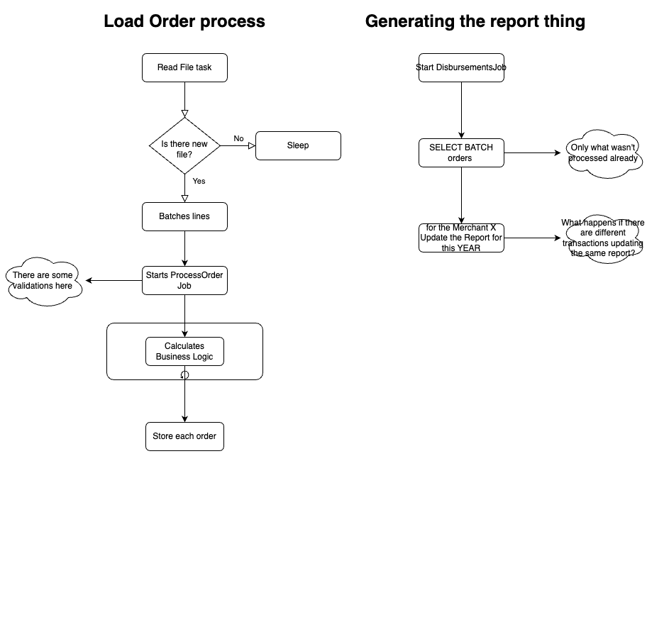

# Disbursement Pipeline

This project manages merchants' information and their orders, executing asynchronous tasks to disburse merchant orders daily by 8:00 PM Europe/London timezone.

## Dependencies

Ensure the following technologies are installed:

- Ruby 3.1.1 (with potential for upgrades)
- Sidekiq 7
- PostgreSQL 14.2
- Ruby on Rails 7

## Configuration

The project uses Docker for containerization and adheres to the [12-Factor App](https://12factor.net/) methodology for service-oriented applications.

Configuration relies on environment variables:

```plaintext
MERCHANT_FILE_DIRECTORY=/files/merchants/*
ORDER_FILE_DIRECTORY=/files/orders/*
```

These variables specify the directories where Sidekiq jobs will search for new merchant and order files to process.

## Sidekiq Jobs

The system includes several Sidekiq jobs for handling different tasks:

- `DisburseOrdersJob`: Processes order disbursements.
- `LoadMerchantsFileJob`: Loads merchant data from CSV files.
- `LoadOrdersFileJob`: Loads order data from CSV files in batches than calls `ProcessOrdersJob`.
- `ProcessOrdersJob`: Receives orders batches then save their in the DB.

### Schedule

- `DisburseOrdersJob`: is scheduled to run every day at 7:50 pm.
- `LoadMerchantsFileJob`: is scheduled to run at every 2 minutes.
- `LoadOrdersFileJob`: is scheduled to run at every 10 minutes.

## Setup

To prepare the application for running, execute the following commands:

```bash
# Install dependencies
bundle install

# Set up your database
bundle exec rails db:setup
```

## Running the Application

Although the project is built with Ruby on Rails, it does not feature a traditional web interface. Instead, it relies on Sidekiq for orchestrating data loading and the processing of disbursements.

To start the application, ensure your enviroment variables are properly configured and that Sidekiq is running to handle background jobs. Then:


```bash
# if you are using your plain ruby env
bundle exec sidekiq

# or if you are using docker
docker-compose run sidekiq bundle exec rails db:setup

# then run its container
docker-compose up sidekiq
```

## Sample data

| YEAR | Number of disbursements | Amount disbursed to merchants | Amount of order fees | Number of monthly fees charged (From minimum monthly fee) | Amount of monthly fee charged (From minimum monthly fee) |
|------|-------------------------|-------------------------------|----------------------|-----------------------------------------------------------|----------------------------------------------------------|
| 2022 | 1680                    | €37,527,397.00                | €338,357.00          | 1082                                                      | €26,085.00                                               |
| 2023 | 11063                   | €187,960,259.00               | €1,698,717.00        | 7324                                                      | €176,580.00                                              |

This table above shows the aggregated data from sample merchants and orders for the years of 2022 and 2023. You can load it in your environment using this task:

```bash
# It will load data from the 01/01/2022 until 31/12/2023
# it may take time due to the sequencial execution order.

bundle exec rake load_sample_data:run
```

You can replicate it using using the following SQL query:

```sql
set lc_monetary to "en_IE.UTF-8";

SELECT
    EXTRACT(year FROM d.created_at) AS "YEAR",
    count(d.id) as "Number of disbursements",
    SUM(d.net_amount_cents / 100) :: float8 :: numeric :: money AS "Amount disbursed to merchants",
    SUM(d.fee_amount_cents / 100) :: float8 :: numeric :: money AS "Amount of order fees",
    SUM(CASE WHEN d.fee_minimum_amount_cents > 0 then 1 else 0 END) AS "Number of monthly fees charged (From minimum monthly fee)",
    SUM(d.fee_minimum_amount_cents / 100) :: float8 :: numeric :: money AS "Amount of monthly fee charged (From minimum monthly fee)"
FROM disbursements d
GROUP BY "YEAR";
```

## Technical design



